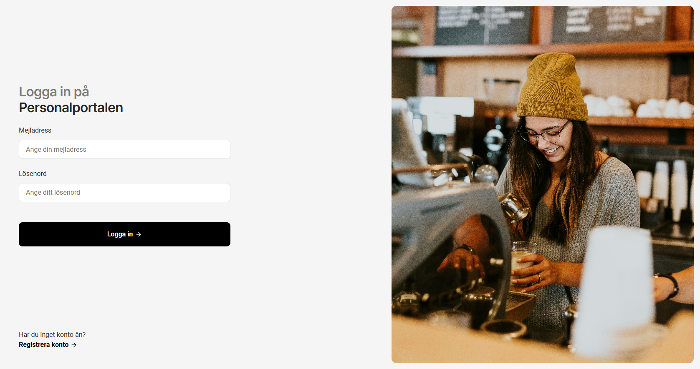
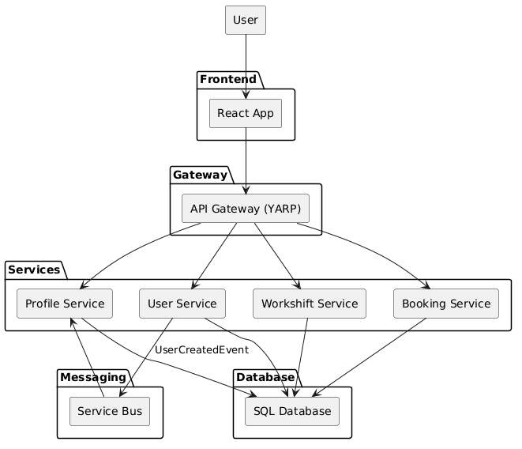

# StaffSystem

## TL;DR

A production-style fullstack system for booking work shifts.

- .NET microservices + React frontend
- API Gateway (YARP)
- Event-driven architecture (service bus)
- Docker-based deployment

https://rasmuswaleij.se/personalportalen

---

## Overview

This project was built as my final portfolio project during my .NET Fullstack YH education.

Instead of building multiple small demos, I focused on creating one realistic system that demonstrates how modern software is built, tested, secured and deployed.

The system is designed with a focus on:

- API Gateway architecture
- Event-driven communication
- Observability and monitoring
- Scalable and maintainable system design

The application is publicly deployed and can also be run locally using Docker.

---

## Screenshots

<p align="center">
  
  
</p>

---

## What makes this project interesting?

- Handles async workflows using events (user → profile auto-creation)
- Uses API Gateway to centralize auth and routing
- Demonstrates real-world DevOps setup (Docker + environment configs)
- Implements observability (tracing + health checks)

---

## Architecture



### Request flow

1. Client calls API Gateway
2. Gateway validates JWT
3. Request routed to correct service
4. Services communicate via events when needed

### Key capabilities

- API Gateway using YARP (routing, authentication, cross-cutting concerns)
- Event-driven communication via service bus
- Containerized microservices using Docker
- Centralized authentication (JWT)
- Observability with OpenTelemetry, correlation IDs and health checks
- Clean Architecture with clear separation of concerns

---

## Event-Driven Communication

The system uses a service bus for asynchronous communication between services.

### Example flow

1. User registers
2. User service publishes `UserCreated`
3. Profile service consumes event
4. Profile is created automatically

### Benefits

- Loose coupling between services
- Better scalability
- More resilient system design

---

## Live Demo

Frontend:
https://rasmuswaleij.se/personalportalen

API Gateway:
https://rasmuswaleij.se/api

---

## Deployment

### Environment support

The system is designed to run in multiple environments:

- Local development via Visual Studio
- Local containerized setup using Docker Compose
- Cloud deployment on a VM

Environment-specific configurations are handled through Docker Compose and environment variables.

### Deployment flow

- Code pushed to repository
- Docker images are built
- Services are deployed behind API Gateway
- Configuration handled via environment variables

---

## Architectural Decisions

- Clean Architecture → separation between API, Application, Domain, Infrastructure
- API Gateway → avoids duplicated auth logic across services
- Event-driven communication → removes direct service dependencies

---

## Get Started

### Clone the repository

```bash
git clone https://github.com/StaffSystemW/staffsystem.git
```

### Run locally with Docker

Use Docker Compose (v2 preferred):

```bash
docker compose up --build
```

If you are on an older setup:

```bash
docker-compose up --build
```

Services will start automatically:

Frontend: http://localhost:3000
API Gateway: http://localhost:8080

---

## Frontend

The frontend is built using React with a focus on maintainability and good UX patterns.

### Key features

- Component-driven architecture
- Dedicated API service layer
- Protected routes
- Form validation
- Error handling
- Loading states

### Example structure

frontend
│
├── components
├── pages
├── features
├── services
├── config
└── utils

---

## Backend

The backend consists of ASP.NET Web APIs designed around Clean Architecture.

### Features

- RESTful CRUD endpoints
- FluentValidation request validation
- Global exception handling middleware
- Dependency injection
- Health checks

---

## API Gateway

The system uses YARP as an API Gateway to handle cross-cutting concerns.

### Responsibilities

- Centralized authentication (JWT validation)
- Request routing to backend services
- CORS handling
- Request logging and correlation IDs

This keeps services focused on business logic while the gateway handles shared concerns.

---

## Data & Technologies

### Technologies

- Entity Framework Core
- Code-first migrations

### Core entities

- Users
- Profiles
- Workshifts
- Bookings

---

## Observability

### Distributed tracing

- Correlation IDs are generated and propagated across services
- Enables tracing requests through the entire system

### Health monitoring

- Health endpoints for each service
- Dependency health checks via the gateway

---

## Security

- JWT authentication handled at gateway level
- No direct service exposure (internal network only)
- Environment-based configuration (no secrets in code)

---

## About

.NET Fullstack developer (graduating 2026) with focus on distributed systems and DevSecOps.

Looking for a junior role.

---

## Contact

LinkedIn: [www.linkedin.com/in/rasmus-waleij-4791a7128](http://www.linkedin.com/in/rasmus-waleij-4791a7128)
Email: [rasmus.waleij@gmail.com](mailto:rasmus.waleij@gmail.com)
